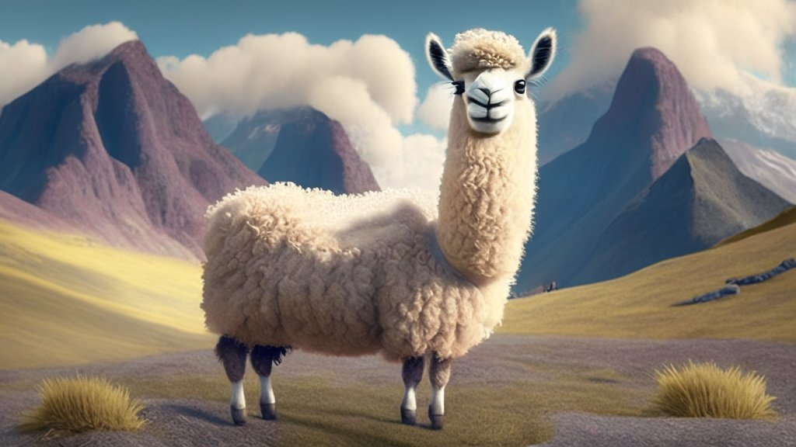

# ⛰️Valley: Video Assistant with Large Language model Enhanced abilitY
Understanding Complex Videos Relying on Large Language and Vision Models

[[Project Page]()] [[Paper](https://arxiv.org/pdf/2306.07207.pdf)]

**Video Assistant with Large Language model Enhanced abilitY** <br>
[Ruipu Luo*](https://github.com/RupertLuo), [Ziwang Zhao*](), [Min Yang*](https://github.com/feymanpriv) (*Equal Contribution)

<p align="center">
    <br>
    Generated by <a href="https://stablecog.com/">stablecog</a> via "A cute llama with valley"
</p>

[](https://github.com/tatsu-lab/stanford_alpaca/blob/main/LICENSE)
[](https://github.com/tatsu-lab/stanford_alpaca/blob/main/DATA_LICENSE)
**Usage and License Notices**: The data, code and checkpoint is intended and licensed for research use only. They are also restricted to uses that follow the license agreement of LLaMA, Vicuna and GPT-4. The dataset is CC BY NC 4.0 (allowing only non-commercial use) and models trained using the dataset should not be used outside of research purposes.

## Release
- [6/13] 🫧 We uploaded model weight of [Valley-13b-v1-delta](https://huggingface.co/luoruipu1/valley-13b-v1-delta).
- [6/12] 🫧 We released Valley: Video Assistant with Large Language model Enhanced abilitY.  Checkout the [paper](https://arxiv.org/pdf/2306.07207.pdf).

## Todo
- ~~Release inference code~~
- ~~Upload weight of **Valley-v1**~~ and build a share link demo
- Release 47k instruction tuning data 
- Upload pretrain and tuning code

## Install
1. Clone this repository and navigate to Valley folder
```
git clone https://github.com/RupertLuo/Valley.git
cd Valley
```
2. Install Package
```
conda create -n valley python=3.10 -y
conda activate valley
pip install --upgrade pip 
pip install -e .
```
## ValleyWeight
We release [Valley]() delta weights weights to comply with the LLaMA model license. You can apply this delta weights to original LLaMA model weight through the instructions blew:

1. Get the original LLaMA weights in the huggingface format by following the instructions structions [here](https://huggingface.co/docs/transformers/main/model_doc/llama).
2. Use the following scripts to get Valley weights by applying our delta ([13b-v1](https://huggingface.co/luoruipu1/valley-13b-v1-delta)).
### Valley 13b v1
```bash
python3 valley/model/apply_delta \
    --base /path/to/llama-13b \
    --target /output/path/to/Valley-13B-v1 \
    --delta luoruipu1/valley-13b-v1-delta
```

## Inference Valley in Command Line


inference CLI
```
python3 inference/run_valley.py --model_name [PATH TO VALLEY WEIGHT] --video_file [PATH TO VIDEO] --quary [YOUR QUERY ON THE VIDEO]
```


## Acknowledgement
- [LLaVA](https://github.com/haotian-liu/LLaVA) & [MOSS](https://github.com/OpenLMLab/MOSS): Thanks to these two repositories for providing high-quality code, our code is based on them.
- 
## Citation
If the project is helpful to your research, please consider citing our paper as follows
···bibtex
@misc{luo2023valley,
      title={Valley: Video Assistant with Large Language model Enhanced abilitY}, 
      author={Ruipu Luo and Ziwang Zhao and Min Yang and Junwei Dong and Minghui Qiu and Pengcheng Lu and Tao Wang and Zhongyu Wei},
      year={2023},
      eprint={2306.07207},
      archivePrefix={arXiv},
      primaryClass={cs.CV}
}
```
